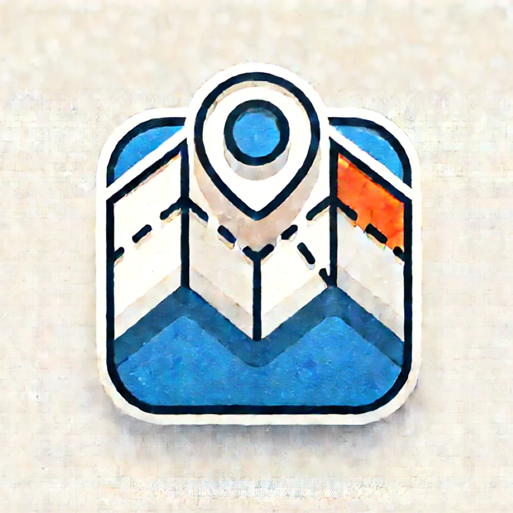
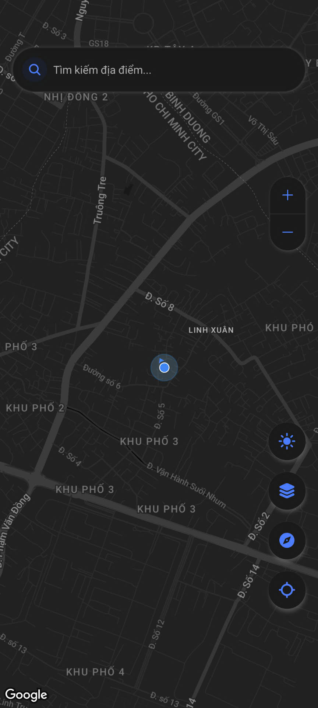
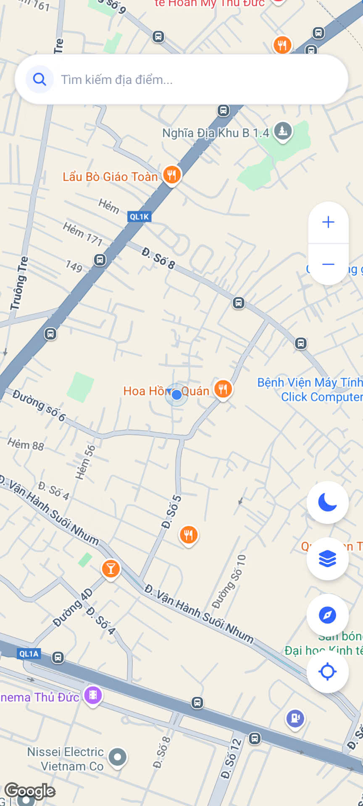
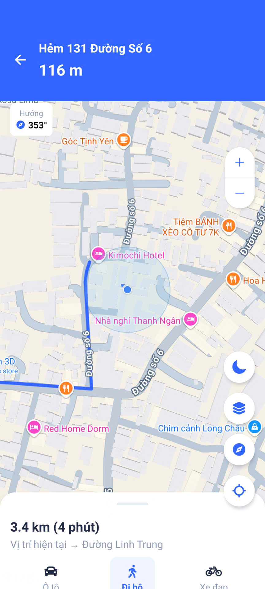
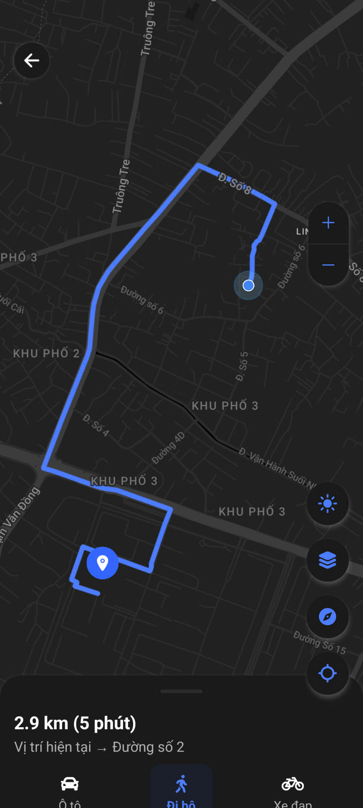
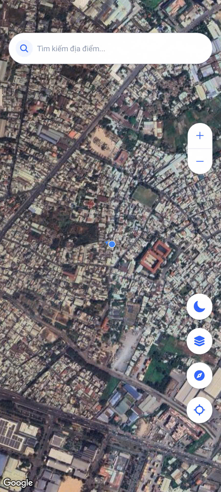
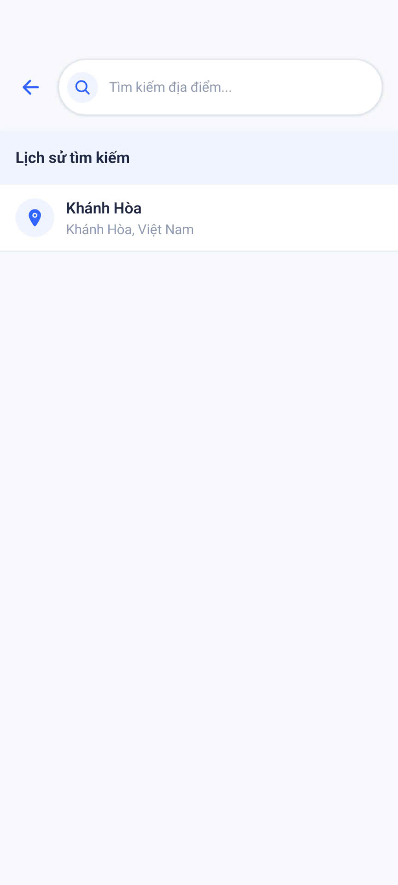
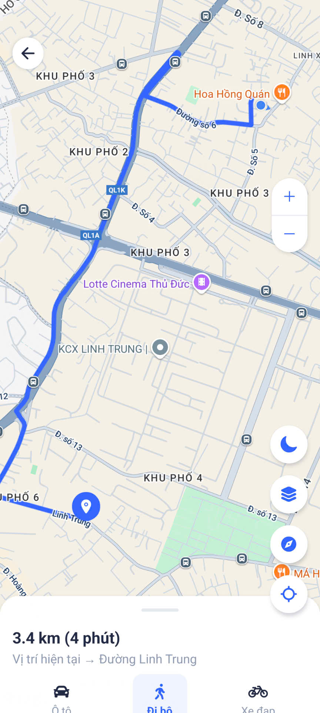
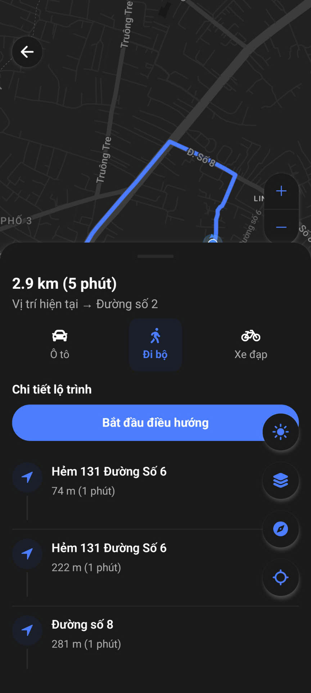

# Go There - Ứng dụng Điều hướng Bản đồ

<div align="center">
  
</div>

## 📱 Giới thiệu

**Go There** là ứng dụng điều hướng bản đồ di động được phát triển bằng React Native và Expo. Ứng dụng cung cấp các tính năng điều hướng tương tự Google Maps nhưng với giao diện tối giản và trải nghiệm người dùng được tối ưu hóa.

### ✨ Tính năng chính

- **Tìm kiếm địa điểm** với giao diện trực quan và lịch sử tìm kiếm
- **Điều hướng chi tiết** với hướng dẫn từng bước
- **Chế độ tối (Dark Mode)** tự động điều chỉnh theo cài đặt hệ thống
- **Hiển thị chỉ dẫn lớn** khi đang điều hướng
- **Bottom sheet** hiển thị chi tiết lộ trình
- **Tự động thu gọn** bottom sheet khi bắt đầu/dừng điều hướng
- **Hiệu ứng mượt mà** khi tìm kiếm và hiển thị kết quả
- **Bản đồ tùy chỉnh** theo chế độ sáng/tối

## 🌟 Mô tả chi tiết

### Giao diện người dùng
- **Thiết kế hiện đại** với các thành phần bo tròn và hiệu ứng đổ bóng
- **Thanh tìm kiếm** được tối ưu hóa với hiệu ứng trượt mượt mà
- **Chế độ tối/sáng** tự động điều chỉnh toàn bộ giao diện, bao gồm cả bản đồ
- **Bottom sheet** có thể kéo thả để xem thông tin chi tiết lộ trình

### Tính năng bản đồ
- **Hiển thị vị trí hiện tại** với độ chính xác cao
- **Tìm kiếm địa điểm** sử dụng OpenStreetMap API
- **Đánh dấu điểm đến** trên bản đồ với animation
- **Hiển thị đường đi** với màu sắc tùy chỉnh theo chế độ giao diện
- **Zoom và xoay bản đồ** với các nút điều khiển trực quan
- **Chỉ báo la bàn** hiển thị hướng hiện tại

### Điều hướng
- **Chỉ dẫn chi tiết** từng bước với khoảng cách và hướng di chuyển
- **Chỉ dẫn lớn** hiển thị ở phía trên khi đang điều hướng
- **Tự động xoay bản đồ** theo hướng di chuyển
- **Hiển thị khoảng cách** đến điểm rẽ tiếp theo
- **Tùy chọn phương tiện** di chuyển (ô tô, xe máy)

## 📸 Ảnh chụp màn hình

<div align="center">
    
    
    
    
    
    
    
    
    
    
</div>

## 🚀 Trải nghiệm ứng dụng

### Người dùng Android

Bạn có thể tải và cài đặt ứng dụng Go There trực tiếp thông qua link sau:

[Tải Go There cho Android](https://expo.dev/accounts/nicha23/projects/go-there/builds/367c5cb6-e1a3-4b26-ab12-702160cc039f)

Hoặc quét mã QR bên dưới:

<div align="center">
  
</div>

## 🛠️ Công nghệ sử dụng

- **React Native** - Framework phát triển ứng dụng di động
- **Expo** - Nền tảng phát triển React Native
- **React Navigation** - Điều hướng trong ứng dụng
- **Expo Router** - Định tuyến dựa trên file
- **React Native Maps** - Tích hợp bản đồ
- **Tailwind CSS (NativeWind)** - Styling
- **OpenStreetMap & Nominatim API** - Dữ liệu bản đồ và tìm kiếm địa điểm
- **Animated API** - Hiệu ứng chuyển động mượt mà

## 🔧 Cài đặt và phát triển

### Yêu cầu

- Node.js (>= 14.0.0)
- npm hoặc yarn
- Expo CLI

### Cài đặt

```bash
# Clone repository
git clone https://github.com/nicha2301/go-there.git

# Di chuyển vào thư mục dự án
cd go-there

# Cài đặt các dependencies
npm install

# Khởi chạy ứng dụng
npm run start
```

## 📝 Tính năng sắp tới

- [ ] Hỗ trợ iOS
- [ ] Tùy chọn phương tiện di chuyển (đi bộ, xe đạp, v.v.)
- [ ] Lưu địa điểm yêu thích
- [ ] Chia sẻ vị trí
- [ ] Thông tin giao thông theo thời gian thực
- [ ] Tùy chỉnh giao diện người dùng
- [ ] Hỗ trợ nhiều ngôn ngữ

## 📄 Giấy phép

Dự án này được phân phối theo giấy phép MIT. Xem tệp `LICENSE` để biết thêm thông tin.

## 👨‍💻 Tác giả

Phát triển bởi [Nicha23](https://github.com/nicha23)

---

<div align="center">
  <p>Made with ❤️ in Vietnam</p>
</div>

## 📖 Hướng dẫn sử dụng

### Tìm kiếm địa điểm
1. Nhấn vào thanh tìm kiếm ở trên cùng màn hình
2. Nhập tên địa điểm bạn muốn tìm
3. Chọn một địa điểm từ kết quả tìm kiếm
4. Bản đồ sẽ hiển thị vị trí và đánh dấu địa điểm đó

### Tìm đường đi
1. Tìm kiếm và chọn địa điểm đến
2. Ứng dụng sẽ tự động tìm đường từ vị trí hiện tại của bạn
3. Xem thông tin chi tiết về lộ trình ở bottom sheet
4. Nhấn nút "Bắt đầu điều hướng" để bắt đầu chỉ dẫn

### Sử dụng chế độ điều hướng
1. Khi đang trong chế độ điều hướng, màn hình sẽ hiển thị chỉ dẫn lớn ở trên cùng
2. Bản đồ sẽ tự động xoay theo hướng di chuyển của bạn
3. Khoảng cách đến điểm rẽ tiếp theo được hiển thị rõ ràng
4. Nhấn nút "Dừng điều hướng" để kết thúc

### Chuyển đổi chế độ sáng/tối
- Ứng dụng tự động điều chỉnh theo cài đặt hệ thống
- Bạn cũng có thể nhấn vào nút chuyển đổi chế độ ở góc phải dưới cùng

## 📞 Liên hệ & Hỗ trợ

Nếu bạn có bất kỳ câu hỏi, góp ý hoặc gặp vấn đề khi sử dụng ứng dụng, vui lòng liên hệ:

- **Email**: nicha230103a@gothere.app
- **GitHub**: [nicha23/go-there](https://github.com/nicha23/go-there)

Chúng tôi luôn sẵn sàng lắng nghe và cải thiện ứng dụng dựa trên phản hồi của người dùng!
